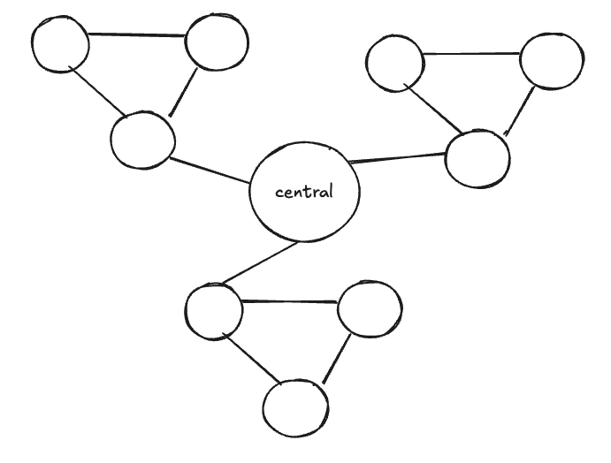
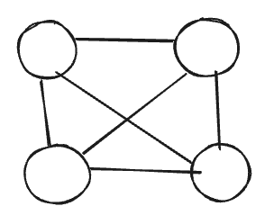

# User Testing Guide

Distro is an easy-to-use web based simulator for testing out distributed algorithms for students and educators.

### Step 1: Installation
Follow the instructions on the project's `README.md` - build the project with the frontend
- You should have two terminals, each of it running the backend and the frontend respectively
- Open up your browswer and go to `http://localhost:3000` to access the frontend

### Step 2: Create a distributed algorithm
You can optionally create your own distributed algorithm here to test out or you can simply rely on the pre-built algorithm that we have provided and skip to Step 3.
For testing purposes, I would recommend you to NOT create your own algorithm at the moment unless you have a strong understanding of distributed algorithms.

If you find yourself researching on a particular distributed algorithm then you can follow the steps below to implement. Before you do so, please read the
report on the API design for you to extend your own distributed algorithm from an interface that we have already defined.
- `cd src/main/java/com/example/programs`: Move into this directory to create your java file that will host your distributed algorithm
- Extend your algorithm from the `NodeProgram` interface and implement the required methods

### Step 3: Create a network topology
Once you have open your web browser, you will be greeted the topology designer page of Distro.
On the left, you would be able to generate any kind of network topology and choose the kind of distributed algorithm each node should run.

You would be able to configure the network jitter configuration too to simulate a more realistic environment.
It is recommend to set a delay of at least `5000ms` for you to able to follow the speed of the algorithm.
Click "generate YAML" once you're satisfied so you can safe keep this particular configuration for use in the future.

On the right, you can view your current topology and connect edges between nodes. The current UI is built upon a third party library and may not provide the 
best experience at the moment.

### Step 4: Run
Press the "Proceed to Simulation" button and click connect to connect to the backend server (Ensure that you backend is running).

Click on "Start Simulation" and wait about a few seconds for the simulation to initialise. You would then be able to see your nodes transmitting
messages between nodes. You would also be able to simulate "fault tolerance" by pausing a node or forcefully shutdown the node. A pause node can be 
resumed but a node that has been shutdown will not be able to recover.

You can also click on each node to view the message inbox for that particular node which would contain all the relevant messages that node has.

## Scenario 1:
This scenario will test the user to create a network topology described below to test out the **FloodingAlgorithm**.
We will then survey the test users to get feedback on the usefulness and effectiveness of the product.

1. Create the network topology following the image below. You can use the auomated generated topology button to create a ring topology of 3 nodes and then create
    an individual node with id `central`. Make sure all the nodes are running **FloodingAlgorithm** by typing that entry into the Program box.

2. Set **Drop Rate** to 0% and **Delay (ms)** to 5000

3. Proceed to simulation and run the simulation to observe the flooding algorithm effects

## Scenario 2:
This scenario will test the user to create a simple **Fully-Connected** topology to test out a simple **LeaderElectionAlgorithm**.
We will then survey the test users to get the feedback on the usefulness and effectivenss of the product.

1. Create the network topology following the image below. You can use the automated generated topology button to create a fully-connected topology of 4 nodes.
    Make sure all the nodes are running the **LeaderElectionAlgorithm** by typing that entry into the Program box.

2. Set **Drop Rate** to 0% and **Delay (ms)** to 5000

3. Proceed to simulation and run the simulation to observe the leader election effects
