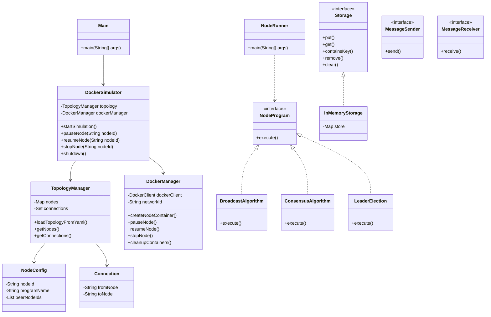

```mermaid
classDiagram
    %% Core application flow (top to bottom)
    Main --> DockerSimulator
    DockerSimulator --> TopologyManager
    DockerSimulator --> DockerManager
    
    %% Model classes under TopologyManager
    TopologyManager --> NodeConfig
    TopologyManager --> Connection
    
    %% Node program hierarchy
    NodeProgram <|.. BroadcastAlgorithm
    NodeProgram <|.. ConsensusAlgorithm
    NodeProgram <|.. LeaderElection
    
    %% Runtime classes
    NodeRunner ..> NodeProgram
    
    %% Interfaces and implementations
    Storage <|.. InMemoryStorage
    
    class Main {
        +main(String[] args)
    }
    
    class DockerSimulator {
        -TopologyManager topology
        -DockerManager dockerManager
        +startSimulation()
        +pauseNode(String nodeId)
        +resumeNode(String nodeId)
        +stopNode(String nodeId)
        +shutdown()
    }
    
    class TopologyManager {
        -Map nodes
        -Set connections
        +loadTopologyFromYaml()
        +getNodes()
        +getConnections()
    }
    
    class DockerManager {
        -DockerClient dockerClient
        -String networkId
        +createNodeContainer()
        +pauseNode()
        +resumeNode()
        +stopNode()
        +cleanupContainers()
    }
    
    class NodeConfig {
        -String nodeId
        -String programName
        -List peerNodeIds
    }
    
    class Connection {
        -String fromNode
        -String toNode
    }
    
    class NodeRunner {
        +main(String[] args)
    }
    
    class NodeProgram {
        <<interface>>
        +execute()
    }
    
    class MessageSender {
        <<interface>>
        +send()
    }
    
    class MessageReceiver {
        <<interface>>
        +receive()
    }
    
    class Storage {
        <<interface>>
        +put()
        +get()
        +containsKey()
        +remove()
        +clear()
    }
    
    class InMemoryStorage {
        -Map store
    }
    
    class BroadcastAlgorithm {
        +execute()
    }
    
    class ConsensusAlgorithm {
        +execute()
    }
    
    class LeaderElection {
        +execute()
    }
```
