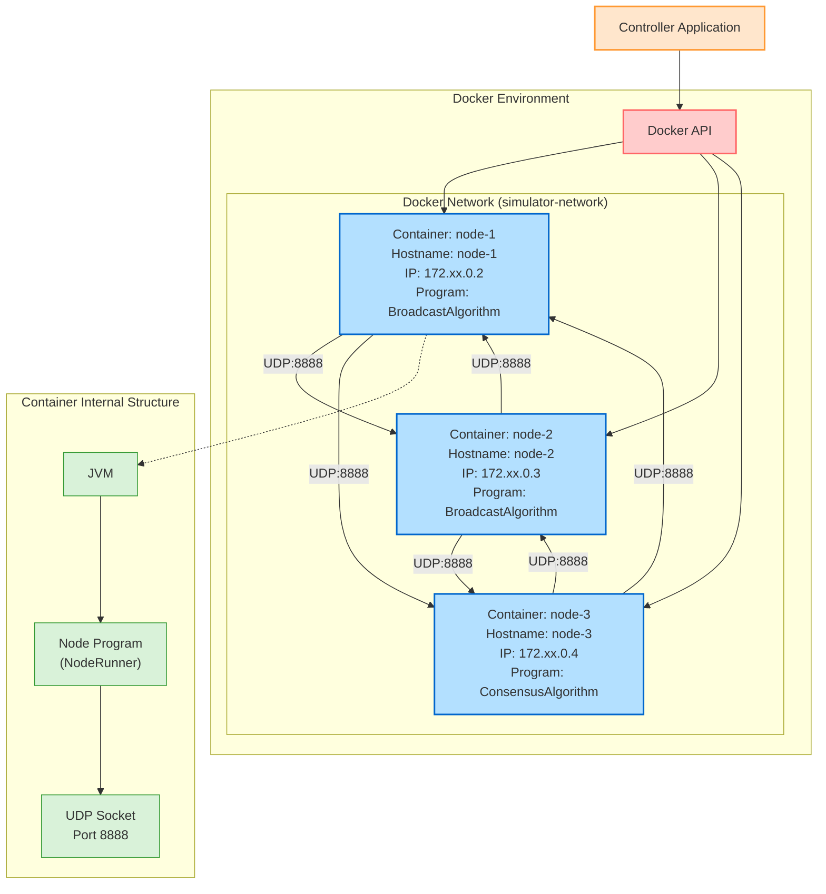

```mermaid
graph TB
    subgraph "Docker Environment"
        subgraph "Docker Network (simulator-network)"
            Container1["Container: node-1<br>Hostname: node-1<br>IP: 172.xx.0.2<br>Program: BroadcastAlgorithm"]
            Container2["Container: node-2<br>Hostname: node-2<br>IP: 172.xx.0.3<br>Program: BroadcastAlgorithm"]
            Container3["Container: node-3<br>Hostname: node-3<br>IP: 172.xx.0.4<br>Program: ConsensusAlgorithm"]
            
            Container1 -- "UDP:8888" --> Container2
            Container2 -- "UDP:8888" --> Container1
            Container1 -- "UDP:8888" --> Container3
            Container3 -- "UDP:8888" --> Container1
            Container2 -- "UDP:8888" --> Container3
            Container3 -- "UDP:8888" --> Container2
        end
        
        DockerAPI[Docker API]
    end
    
    Controller[Controller Application]
    
    Controller --> DockerAPI
    DockerAPI --> Container1
    DockerAPI --> Container2
    DockerAPI --> Container3
    
    subgraph "Container Internal Structure"
        JVM["JVM"]
        NodeProgram["Node Program<br>(NodeRunner)"]
        UDPSocket["UDP Socket<br>Port 8888"]
        
        JVM --> NodeProgram
        NodeProgram --> UDPSocket
    end
    
    Container1 -.-> JVM
    
    classDef container fill:#b3e0ff,stroke:#0066cc,stroke-width:2px
    classDef controller fill:#ffe6cc,stroke:#ff9933,stroke-width:2px
    classDef api fill:#ffcccc,stroke:#ff6666,stroke-width:2px
    classDef internal fill:#d9f2d9,stroke:#339933,stroke-width:1px
    
    class Container1,Container2,Container3 container
    class Controller controller
    class DockerAPI api
    class JVM,NodeProgram,UDPSocket internal
```
