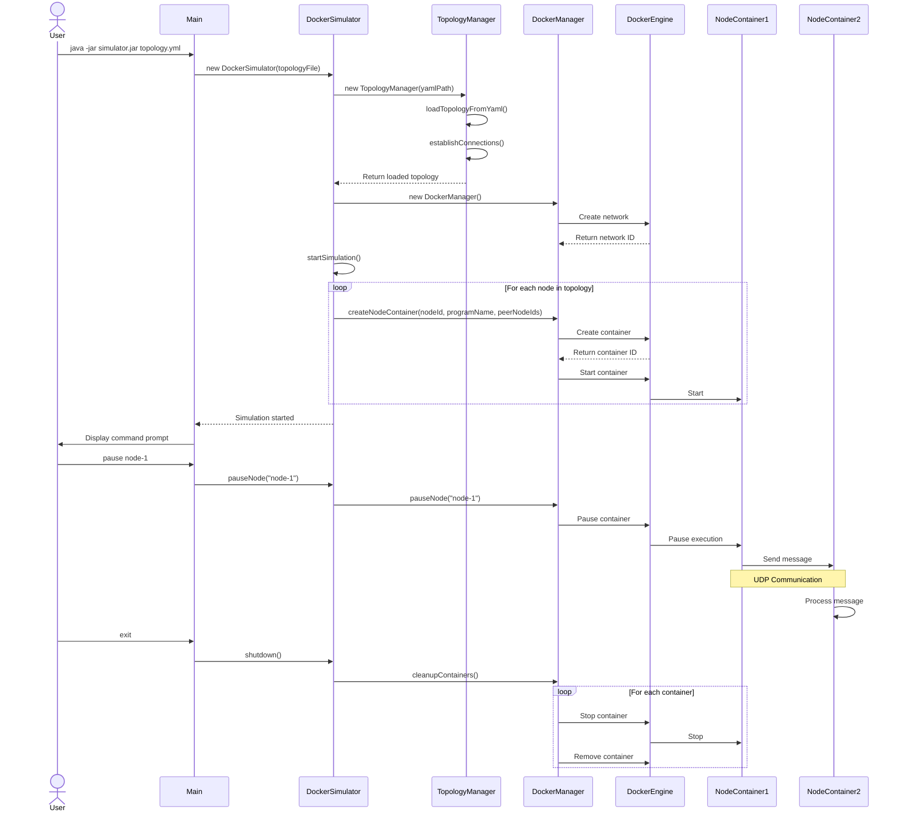

```mermaid

sequenceDiagram
    actor User
    participant Main
    participant DockerSimulator
    participant TopologyManager
    participant DockerManager
    participant DockerEngine
    participant NodeContainer1
    participant NodeContainer2
    
    User->>Main: java -jar simulator.jar topology.yml
    Main->>DockerSimulator: new DockerSimulator(topologyFile)
    DockerSimulator->>TopologyManager: new TopologyManager(yamlPath)
    TopologyManager->>TopologyManager: loadTopologyFromYaml()
    TopologyManager->>TopologyManager: establishConnections()
    TopologyManager-->>DockerSimulator: Return loaded topology
    DockerSimulator->>DockerManager: new DockerManager()
    DockerManager->>DockerEngine: Create network
    DockerEngine-->>DockerManager: Return network ID
    
    DockerSimulator->>DockerSimulator: startSimulation()
    loop For each node in topology
        DockerSimulator->>DockerManager: createNodeContainer(nodeId, programName, peerNodeIds)
        DockerManager->>DockerEngine: Create container
        DockerEngine-->>DockerManager: Return container ID
        DockerManager->>DockerEngine: Start container
        DockerEngine->>NodeContainer1: Start
    end
    
    DockerSimulator-->>Main: Simulation started
    Main->>User: Display command prompt
    
    User->>Main: pause node-1
    Main->>DockerSimulator: pauseNode("node-1")
    DockerSimulator->>DockerManager: pauseNode("node-1")
    DockerManager->>DockerEngine: Pause container
    DockerEngine->>NodeContainer1: Pause execution
    
    NodeContainer1->>NodeContainer2: Send message
    Note over NodeContainer1,NodeContainer2: UDP Communication
    NodeContainer2->>NodeContainer2: Process message
    
    User->>Main: exit
    Main->>DockerSimulator: shutdown()
    DockerSimulator->>DockerManager: cleanupContainers()
    loop For each container
        DockerManager->>DockerEngine: Stop container
        DockerEngine->>NodeContainer1: Stop
        DockerManager->>DockerEngine: Remove container
    end
```
